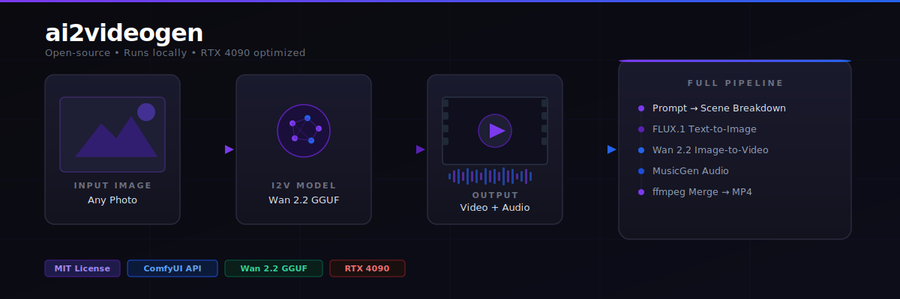

<p align="center">
  
</p>

# ai2videogen

Local AI video generation pipeline — animate images with **Wan 2.2 GGUF**, generate with **LTX-Video**, orchestrated via **ComfyUI API**. Optimized for RTX 4090 + 24 GB VRAM. No cloud. No API keys.

---

## Quick start

```bash
# Check ComfyUI is running
python cli.py status

# Start ComfyUI if it isn't
python cli.py start

# Animate an image
python cli.py animate photo.png --prompt "head turns slowly, soft light"

# Portrait, fast mode
python cli.py animate photo.png --prompt "..." --portrait --fast

# Web UI
python app.py        # opens at http://localhost:7860
```

---

## CLI (`cli.py`)

```bash
python cli.py animate IMAGE --prompt "..." [options]
```

| Flag | Default | Notes |
|------|---------|-------|
| `--model` | `wan-gguf` | `wan-gguf` · `ltx` · `wan-fp8` |
| `--portrait` | off | Sets 480×832 |
| `--fast` | off | 41 frames, 15 steps (~4 min) |
| `--frames` | `81` | Must be `4n+1` |
| `--steps` | `20` | |
| `--seed` | random | |
| `--output` | `./outputs` | |

```bash
python cli.py status   # check if ComfyUI is running
python cli.py start    # start ComfyUI on port 8189
```

---

## Web UI (`app.py`)

```bash
pip install gradio
python app.py
```

Opens at **http://localhost:7860** — upload an image, describe the motion, hit Generate.

---

## Scripts

### `wan_gguf_generate.py` — Wan 2.2 GGUF Q4_K_M (recommended)

Two-pass HIGH + LOW noise image-to-video using 4-bit quantized 14B models. Best quality on a single 4090.

```bash
python wan_gguf_generate.py image.png --prompt "describe the motion" --output ./outputs
```

```bash
# Portrait
python wan_gguf_generate.py photo.jpg --prompt "..." --width 480 --height 832

# Whole folder
python wan_gguf_generate.py ./images/ --prompt "..." --output ./clips

# Shorter clip, faster run (~4 min)
python wan_gguf_generate.py image.png --prompt "..." --frames 41
```

| Flag | Default | Notes |
|------|---------|-------|
| `--frames` | `81` | Must be `4n+1`. 81 ≈ 3.4 s at 24 fps |
| `--steps` | `20` | More steps = better quality, slower |
| `--width` / `--height` | `832` / `480` | Swap for portrait |
| `--cfg` | `6.0` | Lower = more motion |
| `--seed` | random | Fix for reproducible results |
| `--blocks-to-swap` | `30` | CPU offload blocks (14B has 40 total) |

---

### `ltx_generate.py` — LTX-Video 2 (fast)

Lighter alternative — fits entirely in VRAM without block swapping. Faster but lower fidelity than Wan 2.2.

```bash
python ltx_generate.py image.png --prompt "woman walks through neon city" --output ./clips
```

---

### `generate.py` — Wan 2.2 fp8 + VBVR workflow

Full-precision fp8 pipeline with VBVR LoRA. Requires fp8 safetensors models (larger download, higher VRAM).

```bash
python generate.py image.png --prompt "..." --pipeline 3
```

Pipelines: `1` = Standard HIGH + VBVR LoRA · `2` = SNR Hybrid · `3` = VBVR SNR Hybrid (best)

---

## Setup

### 1. ComfyUI

```bash
cd ~/ComfyUI
python main.py --port 8189 --cuda-malloc --use-pytorch-cross-attention
```

> Do **not** use `--highvram` with two-pass GGUF workflows — it keeps both models in VRAM simultaneously and causes OOM.

### 2. Required models

**Wan 2.2 GGUF** → `ComfyUI/models/unet/`
```bash
hf download bullerwins/Wan2.2-I2V-A14B-GGUF \
  wan2.2_i2v_high_noise_14B_Q4_K_M.gguf \
  wan2.2_i2v_low_noise_14B_Q4_K_M.gguf \
  --local-dir ComfyUI/models/unet/
```

**VAE** → `ComfyUI/models/vae/wan_2.1_vae.safetensors`

**T5 text encoder** → `ComfyUI/models/text_encoders/umt5_xxl_fp16.safetensors`

### 3. ComfyUI extensions

```bash
cd ComfyUI/custom_nodes
git clone https://github.com/kijai/ComfyUI-WanVideoWrapper
git clone https://github.com/city96/ComfyUI-GGUF
git clone https://github.com/kijai/ComfyUI-KJNodes
git clone https://github.com/Kosinkadink/ComfyUI-VideoHelperSuite
```

---

## VRAM budget (RTX 4090, Q4_K_M)

| Component | VRAM | Notes |
|-----------|------|-------|
| Active GGUF model (half blocks on GPU) | ~5 GB | 30/40 blocks swapped to RAM |
| T5 encoder | offloaded | CPU after text encoding |
| VAE | ~0.1 GB | |
| Peak during sampling | **~6 GB** | |

Peak RAM: ~15 GB (T5 + model offload)

---

## Coming in Phase 2

- Full pipeline: prompt → scenes → images (FLUX.1) → video clips → audio (MusicGen) → final MP4
- Bring your own images and audio
- Multi-scene orchestration

---

## Requirements

- Python 3.11+
- PyTorch 2.10+ with CUDA 12.8
- ComfyUI with WanVideoWrapper, GGUF, KJNodes, VideoHelperSuite extensions
- RTX 4090 or equivalent (24 GB VRAM recommended)

```bash
pip install sageattention  # recommended — reduces attention VRAM
```
